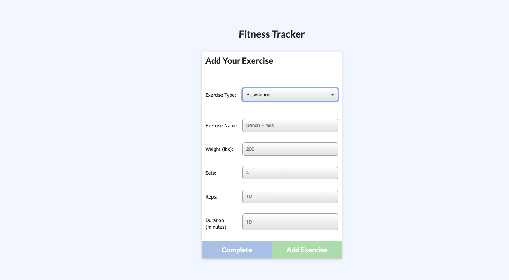
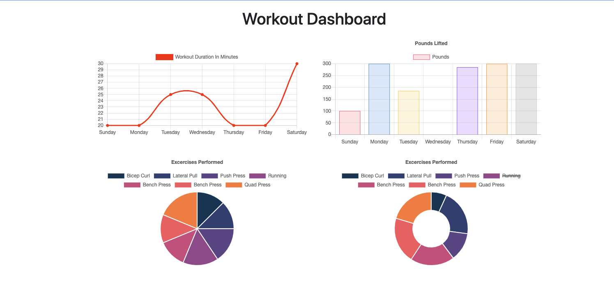

# nosql-workouttracker-hw-17

## Table of Contents

* [Installation](#installation)
* [Usage](#usage)
* [Credits](#credits)
* [URL](#url)
* [License](#mit_license)

## Installation

1. Clone the repo.
2. Run, npm init -y and npm install command in your terminal.
3. Then run node server.js command in your terminal.
4. Follow the link generated in your terminal.
5. There is also a heroku link down below.

## Usage

Fitness Tracker is an application that uses nosql and mlab to provide the user with a persistent list of workouts that they have done in the past 7 days. The user has the ability to log new exercises as well.

The following screenshot demonstrates the application functionality:

## Credits

Other than conferring with TAs, tutors, and my peers; yes, This was a solo project.

## URL

[Link to Deployed Workout Tracker](https://radiant-sierra-45327.herokuapp.com/)

## MIT_License

Copyright (c) [2020] [Stuart Scott]

Permission is hereby granted, free of charge, to any person obtaining a copy
of this software and associated documentation files (the "Software"), to deal
in the Software without restriction, including without limitation the rights
to use, copy, modify, merge, publish, distribute, sublicense, and/or sell
copies of the Software, and to permit persons to whom the Software is
furnished to do so, subject to the following conditions:

The above copyright notice and this permission notice shall be included in all
copies or substantial portions of the Software.

THE SOFTWARE IS PROVIDED "AS IS", WITHOUT WARRANTY OF ANY KIND, EXPRESS OR
IMPLIED, INCLUDING BUT NOT LIMITED TO THE WARRANTIES OF MERCHANTABILITY,
FITNESS FOR A PARTICULAR PURPOSE AND NONINFRINGEMENT. IN NO EVENT SHALL THE
AUTHORS OR COPYRIGHT HOLDERS BE LIABLE FOR ANY CLAIM, DAMAGES OR OTHER
LIABILITY, WHETHER IN AN ACTION OF CONTRACT, TORT OR OTHERWISE, ARISING FROM,
OUT OF OR IN CONNECTION WITH THE SOFTWARE OR THE USE OR OTHER DEALINGS IN THE
SOFTWARE.